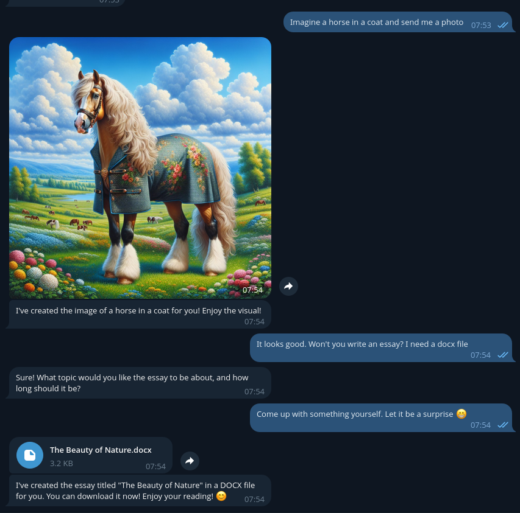

# Knst's Telegram AI Bot

Knst's Telegram AI Bot is designed to enhance your experience with GPT models and DALL·E 3 in Telegram, offering expanded features through OpenAI Tools.

<p align="center">
    
</p>

## Features 🌟

### Core Functionalities

- 📄 File Handling: GPT can read text from .pdf, .html, and .docx files; it can respond in .txt and .docx formats.

- 🔄 Context Modes:
    - Single Mode: Continue interactions with context retention.
    - Multi Mode: Maintain precise context by replying to specific messages.

- 🎭 Telegram Reactions: Dynamic interactions using message reactions.

- 🌐 Web Content Integration: Automatically extract text from web pages without explicit commands.

- 🎨 DALL·E 3 Support: Create imaginative images using the DALL·E 3.

- 🔄 Adaptive Responses: Automatically update responses if you edit your last message.

- 🔧 Custom Presets: Tailor AI interactions with extensive presets, including prompt customization and response settings.

### Features For Owner

- ✅ Whitelist Access: Control user access with a secure whitelist, ensuring only specified users can interact with the bot.

- 🌐 Multi-Server Support: Integrate with multiple AI platforms, like Ollama and OpenAI, for versatile AI management.

- 👥 Admin Support

- 🔧 Flexible Configurations: Easily adjust bot settings and behavior to meet your specific needs.

- 📊 Monthly Usage Insights: Track interactions with monthly usage.

## Commands 🛠

- /add_preset - Create new presets to customize AI behavior.
- /delete - Delete a specific or recent context by replying to a message.
- /new - Start a fresh context, ideal for single-mode interactions.
- /settings - Access the settings menu to customize your bot experience.
- /admin - Admin settings

## Installation 🚀

Docker Compose is required to work.

```bash
git clone https://github.com/isKONSTANTIN/Telegram-AI
cd Telegram-AI/deploy
sudo ./start.sh
```

After downloading the containers and starting for the first time, stop the bot to edit the configuration:

```bash
sudo ./stop.sh
nano tg_ai/configs/main.conf
sudo ./start.sh
```

---

Feel free to fork, modify, and extend this project. Your feedback and feature requests are always appreciated!